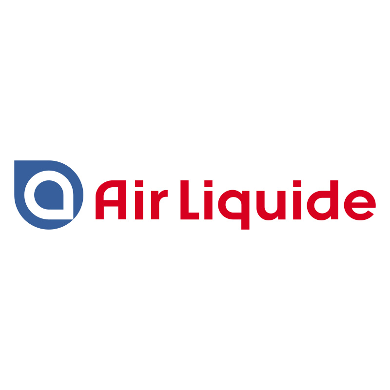

<h1 align="center">
    Blog | Air Liquide
</h1>

<h2>
    
</h2>

# Indice

- [Indice](#indice)
  - [🔖&nbsp; Sobre](#-sobre)
  - [🚀 Tecnologias utilizadas](#-tecnologias-utilizadas)
  - [🗂 Como baixar o projeto](#-como-baixar-o-projeto)
  - [🗂 APIs](#-apis)

## 🔖&nbsp; Sobre

O projeto **BlogAirLiquide** é um blog que foi criado com o intuito de teste de front-end.

---

## 🚀 Tecnologias utilizadas

O projeto foi desenvolvido utilizando as seguintes tecnologias

- [ReactJS](https://reactjs.org)
- [Redux](https://redux.org)
- [Axios](https://github.com/axios/axios)
- [Redux-Saga](https://redux-saga.js.org/docs/api/)
- [Material-UI](https://material-ui.com/pt/)

---

## 🗂 Como baixar o projeto

```bash

    # Clonar o repositório
    $ git clone https://github.com/wasgithub/blog-sysplan.git

    # Entrar no diretório
    $ cd blog-sysplan

    # Instalar as dependências
    $ yarn install

    # Iniciar o projeto
    $ yarn start
```

## 🗂 APIs

- https://jsonplaceholder.typicode.com/users
- https://jsonplaceholder.typicode.com/comments
- https://jsonplaceholder.typicode.com/posts

---

Desenvolvido💜 por Washington Alexandre da Silva
